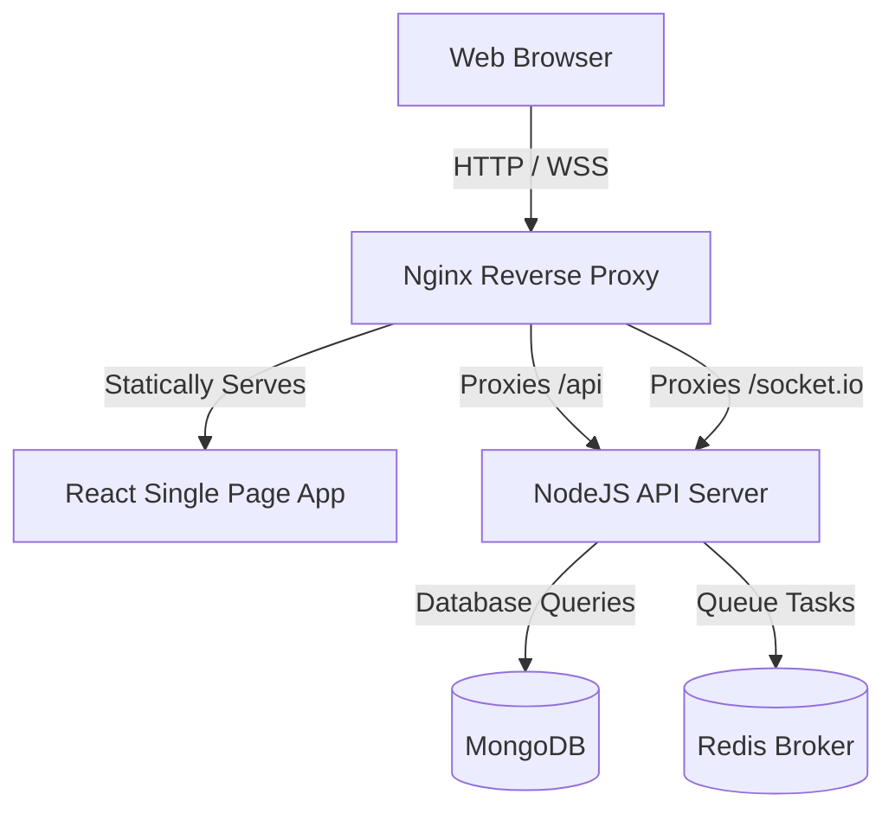

# Picket Deployment Guide

This document describes how to deploy the **Picket** candidate screening platform to production. 

Picket consists of four core services:
1. **Frontend**: A React/Vite application built and served via Nginx.
2. **Backend**: An Express.js Node application containing server endpoints and the BullMQ background analysis worker.
3. **Database**: MongoDB for candidate data and audit logs.
4. **Cache/Queue Broker**: Redis for BullMQ task coordination.

---

## 🛠️ System Architecture



---

## 🐋 Option 1: Docker Compose (Recommended for VPS / Self-Hosting)

Docker Compose provides a single-command setup that launches all required services, pre-configured with a reverse proxy.

### 1. Prerequisites
Ensure you have Docker and Docker Compose installed:
```bash
docker --version
docker compose version
```

### 2. Configure Environment Variables
Create a `.env` file in the root folder of the project. This file will be read by Docker Compose:
```env
JWT_SECRET=your_super_secure_jwt_secret_here
JWT_REFRESH_SECRET=your_super_secure_refresh_secret_here
FRONTEND_URL=http://your-domain-or-ip

# AI Integration keys (optional / fallback)
GEMINI_API_KEY=your_gemini_api_key
GROQ_API_KEY=your_groq_api_key
TAVILY_API_KEY=your_tavily_api_key
```

### 3. Spin Up Services
Run the following command in the project root:
```bash
docker compose up -d --build
```
This builds the customized frontend and backend images and starts all four containers.

### 4. Verify Services
Check the status of running containers:
```bash
docker compose ps
```
The app will be accessible at:
- **Frontend / Dashboard**: `http://localhost` (Port 80)
- **Backend API**: `http://localhost:5000` (Port 5000)

To view backend or worker logs:
```bash
docker compose logs -f backend
```

---

## ☁️ Option 2: Cloud Deployment (Render / Railway / Heroku)

If you are using managed cloud platforms, deploy the **Backend** and **Frontend** as separate web services.

### 1. Database & Cache Setup
1. **MongoDB**: Create a cluster on [MongoDB Atlas](https://www.mongodb.com/cloud/atlas) and obtain a connection string (e.g., `mongodb+srv://...`).
2. **Redis**: Create a Redis instance on [Upstash Redis](https://upstash.com/) or a cloud provider and obtain a connection URL (e.g., `redis://...`).

### 2. Backend Deployment
Deploy the `/backend` directory as a **Web Service**.
- **Build Command**: `npm install`
- **Start Command**: `node server.js`
- **Environment Variables**:
  - `PORT=5000`
  - `MONGO_URI` = `<your_mongodb_atlas_uri>`
  - `REDIS_URL` = `<your_redis_connection_url>`
  - `JWT_SECRET` = `<generate_strong_secret>`
  - `JWT_REFRESH_SECRET` = `<generate_strong_secret>`
  - `FRONTEND_URL` = `<your_production_frontend_url>`
  - `GEMINI_API_KEY` = `<your_gemini_key>` (optional fallback)
  - `GROQ_API_KEY` = `<your_groq_key>` (optional fallback)
  - `TAVILY_API_KEY` = `<your_tavily_key>` (optional fallback)

### 3. Frontend Deployment
Deploy the `/frontend` directory as a **Static Web Service** (e.g., Netlify, Vercel, or Render Static Sites).
- **Build Command**: `npm run build`
- **Publish Directory**: `dist`
- **Environment Variables**:
  - `VITE_API_URL` = `https://your-deployed-backend.com`
- **Redirects/Rewrites Configuration**:
  Since Vite uses client-side routing, ensure you add redirect/rewrite rules so that all deep paths serve `index.html` (HTTP 200).
  *For Netlify (`_redirects`):*
  ```text
  /*    /index.html   200
  ```
  *For Vercel (`vercel.json`):*
  ```json
  {
    "rewrites": [{ "source": "/(.*)", "destination": "/index.html" }]
  }
  ```

---

## 🔒 Production Security Checklist

- [ ] **JWT Secrets**: Ensure `JWT_SECRET` and `JWT_REFRESH_SECRET` are long, random strings. Do not use defaults.
- [ ] **CORS Settings**: Restrict `FRONTEND_URL` in the backend configuration to the exact origin of your frontend application.
- [ ] **SSL/TLS**: Always serve the frontend and backend over `HTTPS`. For VPS deployment, place an Nginx reverse proxy with Let's Encrypt SSL certificates in front of port 80.
- [ ] **Redis Connection**: If Redis is not on localhost, verify it is protected by a strong password/TLS and that the backend uses `REDIS_URL`.
- [ ] **Database Access Rules**: Restrict MongoDB access to the backend IP or configure MongoDB Atlas Network Security to only allow backend service IPs.
